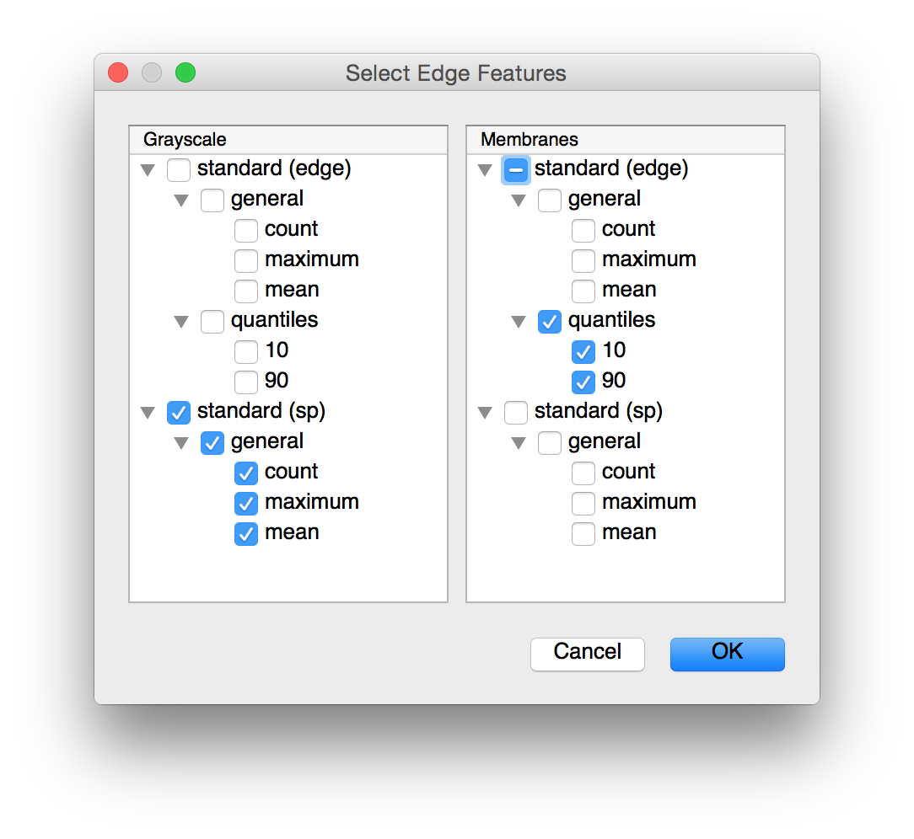

.. currentmodule:: ilastikrag.gui

.. _gui:

Gui Extras
==========

..
   (The following |br| definition is the only way
   I can force numpydoc to display explicit newlines...) 

.. |br| raw:: html

    

Optional gui utilities.  Requires ``pyqt4``.

Feature Selection Widget
------------------------

.. currentmodule:: ilastikrag.gui.feature_selection_widget

.. autoclass:: FeatureSelectionDialog

   .. automethod:: __init__
   .. automethod:: selections

  